# <p align="center"> The Dog Shop: Milestone Project 4


### <p align="center">The image above is a visual of the site displayed on different devices using [I Am Responsive](http://ami.responsivedesign.is/#)

### <p align="center">You can view the live site here: [www.the-dog-shop.com](https://the-dog-shop.herokuapp.com//)

--- 

# <p align="center"> Introduction

Welcome to The Dog Shop - a dedicated store for site users to purchase dog related products. The site also has a dedicated blog section where our dog experts post relevant articles related to dog’s health and wellbeing. Site users can interact with blog posts by adding comments on posts and interacting with other site users. The store is of course fictional and for educational purposes only. 

I built this e-commerce site for my 4th and final milestone project he Code Institutes Full Stack Software Development Course. The overall goal of the project was to design, build and launch a full stack django based software app, that allows users to create an account, be authenticated, store and manipulate data, and purchase products using the stripe payment platform. Due to the nature of the site, additional authentication and validation protocols have been used to prevent unintended use of the site.  

--- 

# Contents

- [**User Experience (UX)**](#UX)
  - [_User Stories_](#user-stories)
  - [_Strategy_](#strategy)
    - [_Site user goals_](#site-user-goals)
    - [_Site owner goals_](#Site-owner-goals)
  - [Scope](#scope)
    - [_Scope In_](#scope-in)
    - [_Scope Out_](#scope-out)
  - [Structure](#structure)
  - [Skeleton](#skeleton)
    - [_Wireframes_](#wireframes)
  - [Surface](#surface)
    - [_Design_](#design)
    - [_Colour_](#colour)
    - [_Typography_](#typography)
- [**Database Set Up**](#database-set-up)
    - [_Models_](#models)
- [**Features**](#features)
  - [_Existing Features_](#existing-features)
  - [_Features Left to Implement_](#features-left-to-implement)
- [**Technologies Used**](#technologies-used)
  - [_Languages_](#languages)
  - [_Frameworks & Libraries_](#frameworks-and-libraries)
- [**Testing**](#testing)
- [**Version Control Management**](#version-control-management)
- [**Deployment**](#deployment)
  - [_Deployment Steps_](#deployment-steps)
  - [_How To run this Project Locally_](#how-to-run-this-project-locally)
- [**Credits**](#credits)
  - [_Content_](#content)
  - [_Media_](#media)
  - [_Code_](#code)
- [**Resources**](#resources)
- [**Acknowledgements**](#acknowledgements)

---

# UX

### User Stories

|   As A       |  I want to be able to...                                |   So that I can...                                       |
| :----------  | :-------------------------------------------------------|----------------------------------------------------------|
| Site User    | Navigate through the site easily                        | Purchase quickly and efficiently                         |
| Site User    | View individual products details                        | Decide if the product is what I need                     |
| Site User    | Search for products on the site                         | Find what I need quickly                                 |
| Site User    | Understand why I need to create and account             | Make a decision on where to share my personal details    |
| Site User    | Make a purchase without having to create an account     | Do not need to share my personal details                 |
| Site User    | Create an account                                       | Save my personal information                             |
| Site User    | Create an account                                       | Comment on and share opinions on recent blog posts       |
| Site User    | Receive email confirmation when creating an account     | Have confirmation that it was successful                 |
| Site User    | Reset my password                                       | Access my account if I forget my password                |
| Site User    | Have a personal profile page                            | View my order history                                    |
| Site User    | Select quantity of individual products                  | Purchase the right quantity I require                    |
| Site User    | Be able to delete any personal comments posted          | Full control over my content                             |
| Site User    | Be notified when I add a product to my shopping bag     | I can easily see what I am buying                        |
| Site User    | See the total cost of my purchase before paying         | Know how my will be charged to be debit/credit card      |
| Site User    | See a payment success or failure message                | Verify that my purchase has been successful              |
| Site User    | Receive a confirmation email after making a purchase    | Have a receipt and record of my purchase                 |
| Site Owner   | Add products to the store from the front end            | Quickly add new products to the site                     |
| Site Owner   | Edit products on the front end                          | Update products details on the site                      |
| Site Owner   | Delete products from the front end                      | Remove products from the site                            |
| Site Owner   | Add blog posts to the site                              | Share relevant information and engage with the site user |
| Site Owner   | Edit blog posts on the site                             | Update the content easily                                |
| Site Owner   | Save draft blog posts in my profile                     | Access and finish at a later time before posting to the site |
| Site Owner   | View all saved draft blog posts in my admin profile     | Easily see all unpublished blog posts                    |
| Site Owner   | Delete blog posts from site                             | Remove content from the site                             |
| Site Owner   | Delete site user comments                               | So that I can remove comments that are not appropriate   |

--- 

## Strategy

### Site user goals

> - Easily navigate a consumer website to find the products that I’m interested in. 
> - Creating an account should be seamless and not require too much personal information or questions. 
> - Checking out should be simple and easy to understand, I should know exactly what is in my basket and how much I am going to pay. 
> - Adding comments and interacting with blog posts should be simple, and I should have control over my content by being able to delete posts whenever I decide to do so. 


### Site owner goals

> - Create a site that provides specific information to a targeted audience. 
> - Create a site that allows site users to easily navigate products, having the ability to search and sort different product types and view individual product details - price, ratings etc. 
> - Create a site that allows users to create an account, enabling them to store their information for quicker checkout. 
> - reate a site that is user friendly and visually indicates when the user has actioned a specific event - like a pop up when adding a product to their shopping bag.
> - Share content to engage site users. Allows users to read and interact with relevant content (Blog Posts) by having the ability to post comments / share opinions on individual articles. 
> -  Create a business revenue stream by targeting a specific market with relevant products.


## Scope

### Scope In

- A homepage that instantly and visually demonstrates what the site’s overall purpose is.
- A one page home page that provides a link to the site product page.
- A nav bar that provides easy navigation to different product ranges. 
- A search bar within the navbar throughout the site to allow users to quickly find relevant products. 
- Product page that visually shows price, ratings and an image. 
- Product details page that shows individual product information with quantity selector. 
- Sorting functionality to allow the site user to sort by price, rating, name or category. 
- Shopping bag icon in the navbar throughout the site, with visual indication of the users total spend. 
- My account section that allows customers to create an account, as well as logging in and out of existing accounts. 
- Dedicate profile page where site users can save their delivery information and view their order history. 
- Active email receipts for account creation verification, password reset, and purchase receipts. 
- Dedicated Blog Page that allows the site owner to post, edit and delete content. 
- Comments structure that allows site users to comment on individual blog posts when signed into their account.
- Site owner ability to add, edit and remove products from the store.
- Site owner admin privileges to remove site user comments.
- Site owner only ability to add, edit and delete blog posts.
- Site owner ability to save draft blog posts in their user profile.
- Stripe payments integration.

### Scope out

- Ability to create an account or sign in using social media accounts.
- Ability to add ratings to products.
- Ability for site users to add blog posts (Only Site Owner's can past blogs).
- Mandatory account creation - account creation only required to save personal information, shopping bag items between sessions or post comments to published blog posts. 
- Site user ability to reply directly to other site user comments. 
- Ability to like, up, or downvote other site user comments. 
- Ability for users to Edit comments (future feature).
- Ability to save payment information. 
- Ability to use google, android or alternative payment payment methods. 
- Requirement for site owners to approve site users comments before being published. 

--- 

## Structure

The structure of the site will be a simplistic flow that navigates the user through the site easily, with the intended purpose of purchasing products. Product information will be displayed clearly with just the right amount of information to allow the user to continue moving forward through the user flow. Account creation and sign in/out will be quick and effortless. 

### Home Page
> - The main page of the site will visually demonstrate the site's purpose so that when a user lands on the home page, there is no confusion as to what the site is. 
> - A link will be placed directly in the middle of the page with a clear call to action of ‘SHOP NOW’, allowing the customer to go straight to the products page. 

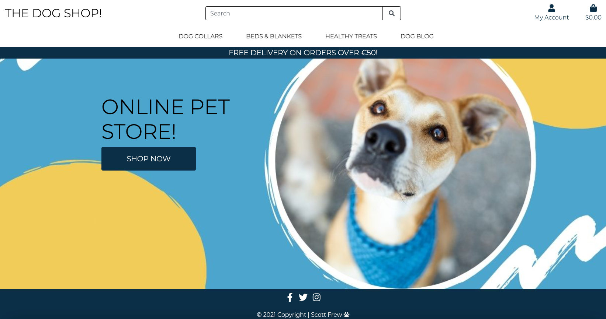

### Search Bar
> - Allows the user to search for products, enabling quicker identification of specific requirements.

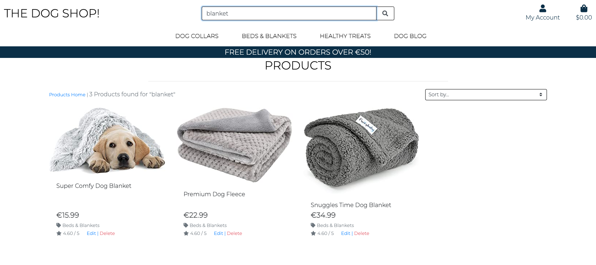

### My Account
> - A drop down nav bar that allows the site user to register or sign into their account, access their personalised profile page or log out of their account. 
> - When in a non-logged state, only a Register and Login link will display. 
> - When logged in and authenticated, a ‘Profile' and 'Logout' link will display. 
> - If the site user is a superuser or admin user, additional links will appear to that user group privileges which will be a Product Admin link and a Blog Admin Link.

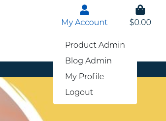

### Shopping bag
> - A shopping bag icon will be present in the navbar which will add up the value of any products added to the user's bag throughout their shopping journey. This allows the users to visually see the total spend as the shop.
> - The total amount of products is also displayed, which increases/decreases as the bag is updated. 

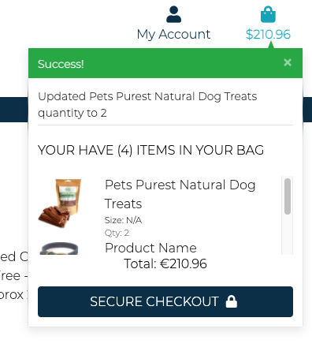

### Navigation links
> - Several product specific navigational links will be displayed to allow the user to navigate quickly to specific product ranges. 

### Call to action banner
> - Underneath the main navigation link, a call to action banner will be displayed to encourage the user to increase their spend, currently this will be free delivery, but in future could also be used for initiatives like discount codes or shipping information. 

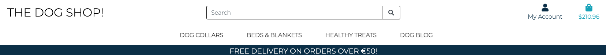

### Main Products page
> - All products displayed on this page. Users will be able to sort by Price, Rating, Name or Category. 

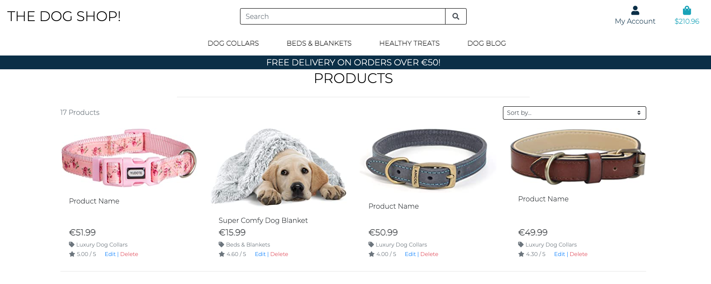

### Individual Products page
> - Page specific to a product a user clicked on. This page will display the product details, including Price, Category and Rating. 
> - A quantity selector allows the user to increase or decrease the quantity of the product they wish to buy. 
> - If the product comes in a range of sizes, a size selector drop down will appear. 
> - A Continue Shopping button will allow the user to return to the product page. 
> - An Add to bag button will allow the user to add the product to their shopping bag. 


### Shopping bag toast pop up:
When an item is added to the Shopping Bag, a pop up appears to visually show the user their shopping bag details. This includes:
> - Success message
> - Total items in Shopping Bag
> - Total cost inc/exc delivery
> - Amount of additional spend required to obtain free delivery. 
> - Secure Checkout Button

### Shopping Bag
When the ‘Secure Checkout’ button is clicked, the user will be navigated to their shopping bag. This page will contain:
> - Product info and image
> - Total Price of each individual product
> - Quantity selector to allow users to update the quantity of each item in their bag. 
> - Total cost
> - Delivery Cost
> - Grand Total Cost
> - If a user has not spent enough to qualify for free shopping, a message will display advising how much additional spend is required.
> - A ‘Continue Shopping’ button to allow users to go back to the main products page. 
> - A ‘Secure Checkout’ button which will take the user to the main Check Out Page. 

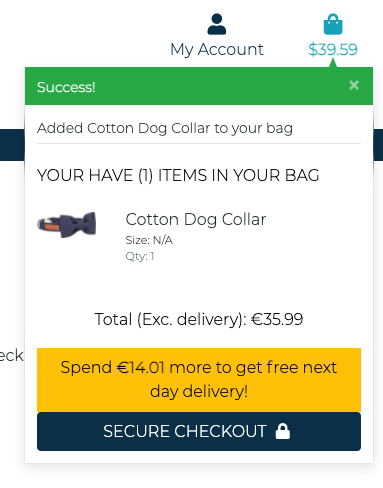

### Check Out Page
> - A simple checkout page where the user will see their order summary and a checkout form for entering their delivery details. 
> - A call to action will be displayed to encourage the user to create and account or sign in to save their information. 
> - If a user is logged in, and information has been saved previously, the delivery details stored will be pre filled, allowing the user to checkout quicker. 
> - A payment section, allowing the user to add their payment method.
> - A message will appear to demonstrate once again how much the user will be charged.


### Checkout Success Page
> - When payment is successful, a checkout success page will display, showing the user their order confirmation number, order summary and delivery information. 
> - A link to allow the user to return to the main products page. 
> - Upon successful completion of an order, the user will be sent a confirmation e-mail containing their order number and order details.


### User Profile Page
> - Personalised profile page where users can store their delivery information. 
> - If a user is logged in when making a purchase, their order details will be stored and displayed in their profile page order history section - this contains order number and summary of items purchased. 
> - If the user is a superuser or Admin (Site Owner), their profile page will also contain any unpublished blogs. These blogs can be edited and posted live on the site from within this page.


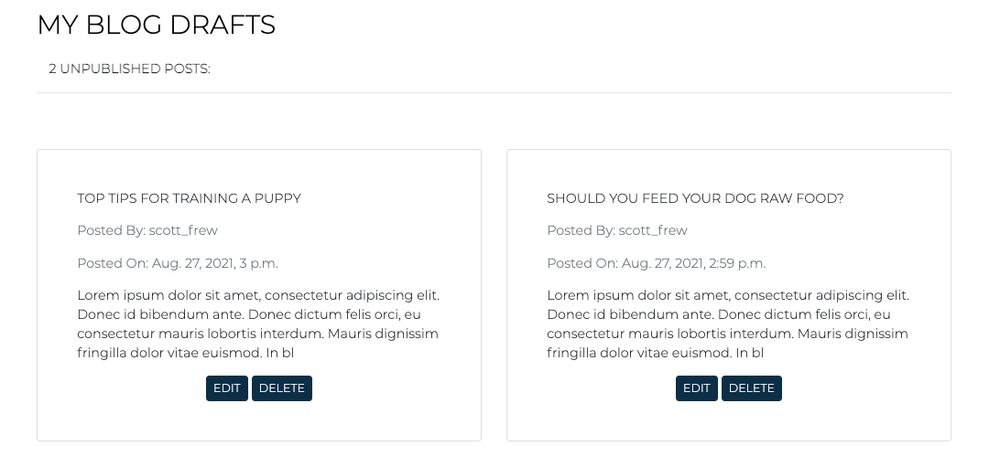
 
### Blog Management
> - Allows Site Owners to create draft blog posts and either post directly onto the site or save for later. 
> - Draft (unpublished) blog posts will be saved to the Site Owners profile page. 

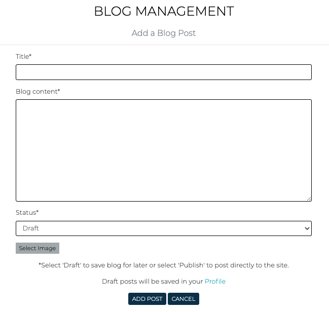

### Product Management
> - Allows Site Owners to add products directly to the store. 
> - Store owners will also be able to edit and delete products on the main products page and the individual product page. 


### Blog Page
> - Dedicated blog page which will be used for presenting market specific content. 
> - Users can access blogs and information on this page. 
> - Total number of blog posts displayed which adjusts as blogs are added/removed. 

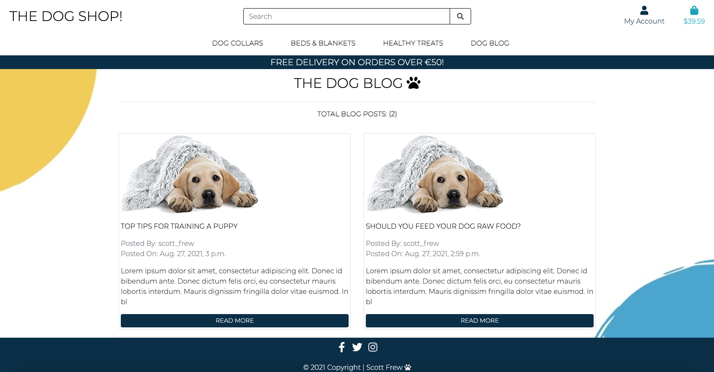
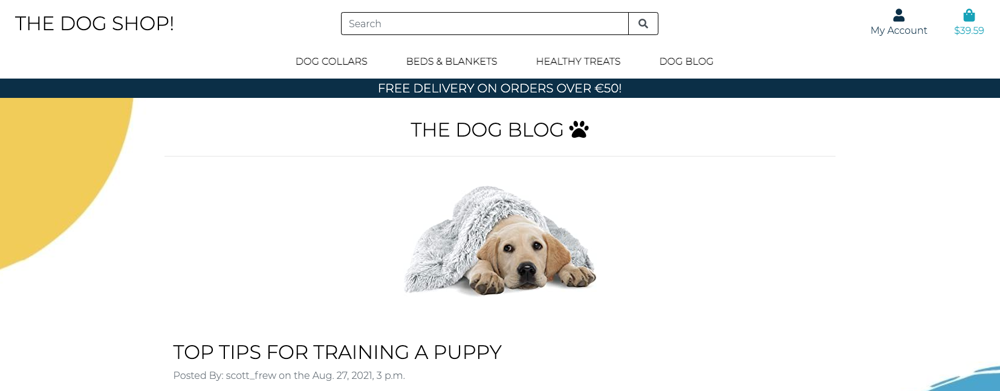

### Comments Section 
> - A comments section will be contained within individual blog post pages, allowing the user to add comments and opinions to posted blog posts. 
> - Users will be able post and delete their own comments. 
> - Total number of comments displayed which adjusts as comments are added/removed. 
> - Superusers (Site Owners) will be able to delete all comments without restriction.

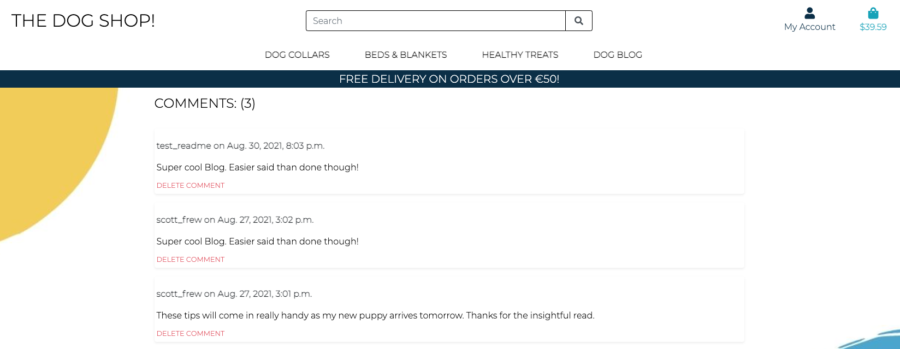
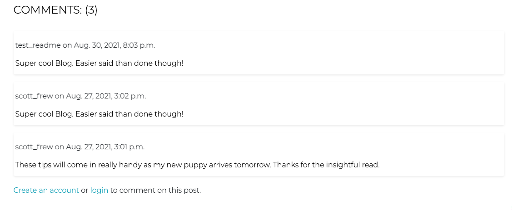
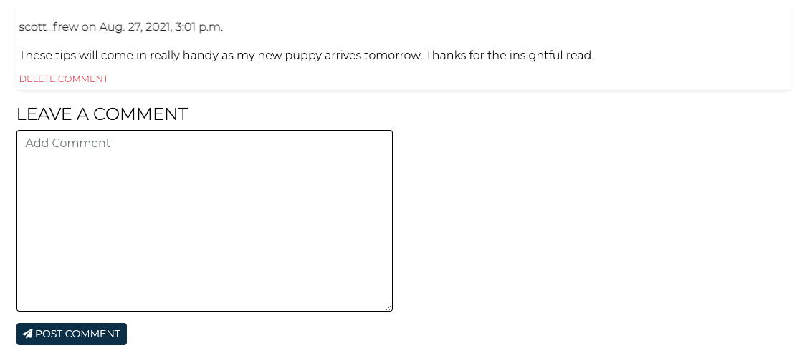

### Footer 
> - A simple fixed footer that contains links to the company social media accounts. The footer will only be present on larger screens and will not be visible on mobile devices to improve the mobile shopping experience.  

--- 

## Skeleton

- The website has been designed to allow the user to navigate through the journey effortlessly. 
- The My Account section within the nav bar is designed to display relevant to whether the user is logged into the site or not. 
- The user will flow through the shopping journey from product selection through to payment. 
- The user will be able to create an account easily so that they can save/update their information and review order history in a dedicated profile page.
- Once logged in, the user will also be able to comment on blog posts. They will have the ability to delete comments, but not edit. 
- If user logs out, they will be asked to confirm before being navigated to the home page. 
- If the user logs out, their shopping bag session will end and bag contents set to zero. 

### Wireframes

All wireframes were created using [Balsamic](https://balsamiq.com/).

The wireframes for both mobil and desktop can be found below.

- [Mobile Wireframes](https://github.com/scotty-james/the-dog-shop--MS4/blob/main/documents/docs/wireframes_mobile.pdf)
- [Desktop Wireframes](https://github.com/scotty-james/the-dog-shop--MS4/blob/main/documents/docs/wireframes_desktop.pdf)

--- 

## Surface

### Design

The website’s primary purpose in an ecommerce site and as such the the design of the store has been simplistic without any distraction. The main page has only one call to action which is a SHOP NOW button. 

The product page is dedicated to products and relevant product information. Customers can navigate back and forth from their shopping bag however the main goal is to seamlessly navigate the customer through to the checkout page in as little clicks as possible. The footer is simple and provides links to the site's social media platforms. 

A dedicated blog page provides relevant content and allows the user to interact by being able to post comments to individual blog posts. The blog section is accessed via a link in the nav bar, but otherwise is not promoted throughout the customer journey. 

### Colour

The color scheme is very simple in nature to align with the crisp design of the site, three colours have been used throughout - white, blue & yellow. 
- #0b2f47
- #4ba5cd
- #f2cc59


### Typography

In line with the website's simple and clean design, Only one font has been used throughout - Montserrat! 


--- 

# Database Set Up

For the development of the project, [SQLite3](https://www.sqlite.org/index.html) was used. [Heroku Postgres](https://www.heroku.com/postgres) was used for production. There are a total of 7 models built to support the project, each one detailed below. 

## Models

## <p align="center">Blog App

###  Post Model

| Field | Field Type | Field Options |
| --- | --- | --- |
| title | CharField | max_length=200, unique=True|
| user | ForeignKey | User, on_delete=models.CASCADE, related_name='blog_posts |
| updated_on | DateTimeField | auto_now=True |
| date_posted | DateTimeField | auto_now_add=True |
| blog_content | TextField |  |
| created_on | DateTimeField | auto_now_add=True |
| status | IntegerField | choices=STATUS, default=0 |
| image | ImageField | null=True, blank=True |
|


### Comment Model

---
| Field | Field Type | Field Options |
| ---   | --- | --- |
|user | ForeignKey | User, on_delete=models.CASCADE |
|post | ForeignKey | Post, on_delete=models.CASCADE, related_name="comments" |
|comment_content | TextField | null=False, blank=False |
|created_on | DateTimeField | auto_now_add=True |
|

## <p align="center">Products App

### Category Model

| Field | Field Type | Field Options |
| ---   | --- | --- |
| name  | CharField | max_length=254 |
| friendly_name  | CharField | max_length=254, null=True, blank=True |
|

### Product Model

| Field | Field Type | Field Options |
| --- | --- | --- |
| name | CharField | max_length=254, null=True |
| description | TextField |  |
| price | DecimalField | max_digits=6, decimal_places=2 |
| has_sizes | BooleanField | default=False, null=True, blank=True |
| category | ForeignKey | 'Category', null=True, blank=True, on_delete=models.SET_NULL |
| rating | DecimalField | max_digits=6, decimal_places=2, null=True, blank=True |
| image | ImageField | null=True, blank=True |
|

## <p align="center">Checkout App

### Order Model

| Field | Field Type | Field Options |
| --- | --- | ---|
| order_number | CharField | max_length=32, null=False, editable=False |
| user_profile | ForeignKey | serProfile, on_delete=models.SET_NULL, null=True, blank=True, related_name='orders' |
| full_name | CharField | max_length=50, null=False, blank=False |
| dog_name | CharField | max_length=50, default=None, null=True, blank=False |
| email | EmailField | max_length=254, null=False, blank=False |
| phone_number | CharField | max_length=20, null=False, blank=False) |
| country | CountryField | blank_label="Country *", null=False, blank=False |
| postcode | CharField | max_length=20, null=True, blank=True |
| town_or_city | CharField | max_length=40, null=False, blank=False |
| street_address1 | CharField | max_length=80, null=False, blank=False |
| street_address2 | CharField | max_length=80, null=True, blank=True |
| county | CharField | max_length=80, null=True, blank=True |
| date | DateTimeField | auto_now_add=True |
| delivery_cost | DecimalField | max_digits=6, decimal_places=2, null=False, default=0 |
| order_total  | DecimalField | max_digits=10, decimal_places=2, null=False, default=0 |
| grand_total  | DecimalField | max_digits=10, decimal_places=2, null=False, default=0 |
| original_bag | TextField | null=False, blank=False, default='' |
| stripe_pid | CharField | max_length=254, null=False, blank=False, default='' |
|

### OrderLineItem Model

| Field | Field Type | Field Options |
| --- | --- | ---|
| order | ForeignKey | Order, null=False, blank=False, on_delete=models.CASCADE, related_name='lineitems' |
| product | ForeignKey | Product, null=False, blank=False, on_delete=models.CASCADE |
| product_size | CharField | max_length=2, null=True, blank=True |
| quantity | IntegerField | null=False, blank=False, default=0 |
| lineitem_total | DecimalField | max_digits=6, decimal_places=2, null=False, blank=False, editable=False |
|

## <p align="center">Profile App

### UserProfile Model

| Field | Field Type | Field Options |
| --- | --- | ---|
| user | OneToOneField | User, on_delete=models.CASCADE |
| default_full_name | CharField | max_length=20, null=True, blank=True |
| default_dog_name | CharField | max_length=20, null=True, blank=True |
| default_phone_number | CharField | max_length=20, null=True, blank=True |
| default_street_address1 | CharField | max_length=80, null=True, blank=True |
| default_street_address2 | CharField | max_length=80, null=True, blank=True |
| default_town_or_city | CharField | max_length=40, null=True, blank=True |
| default_county | CharField | max_length=80, null=True, blank=True |
| default_postcode | CharField | max_length=20, null=True, blank=True |
| default_country | CountryField | blank_label='Country', null=True, blank=True |
|

<br>

--- 

# Features

## Existing Features

- My Account link that only displays links to sing in or register when in a non logged in state. 
- A shopping bag in the navbar that displays total spend as the user adds products to their bag. Total spend increase/decreases as the user adds/removes products from their bag. 
- One clear CTA on the main page. 
- A sign up page that allows new users to create an account, which will allow the user to interact with the site
- A sign in page that will allow existing members to sign into their account in order to interact with the site
- Clear messaging to warn the user of specific actions - for example, advising the customer that a user name already exists if they try to create an account using a username that has already been taken.
- Clear messaging to warn the customer when they enter the wrong username and/or password when signing in
- Clear messaging to advise the customer that they have successfully created an account, logged out or logged in. 
User authentication. 
- Email verification requirements to ensure user and site security. Users are sent a link to their email address to verify identity. 
- Ability to reset password. 
All forms have validation to ensure the user enters the required parameters in each form throughout the site.
- A quantity selector button to allow users to increase or decrease products before adding to their shopping bag. 
- A quantity selector in the shopping bag page to allow users to adjust and update the items in their bag. 
- Sort selector in the products page, allowing users to sort products. 
- Search bar in the navbar to allow users quick access to their required products. 
- Pop up Modal when a user adds an item to their bag, providing visual indication of event along with the product added, total items currently in bag and total spend so far. 
- Free delivery messaging within the pop up modal with exact amount of spend required to qualify for free delivery - if shopping spend currently has not reached free delivery threshold. 
Order summary including product image displayed on checkout page. 
- Ability for users to create an account or sign in when on the checkout page - in order to save their information. 
- Messaging underneath the payment section showing total cost being charged to the card. 
- Personalised checkout success page showing order number, confirmation and order summary. 
- Email receipt of order sent to users e-mail address, containing order number, confirmation and order summary. 
- Personalised profile page showing full order history - if user purchases while logged in. 
- Privilege level user group access, including super user only access to Product Management and Blog Management of the site. 
- Site user ability to add comments to individual blog posts when logged into their account. 
- Site user ability to delete their own individual comments when signed into their account. 
- Site user ability to add and update their personal information within their personalised profile page. 
- Superuser ability to add, edit and delete products on the site. 
- Superuser ability to add, edit and delete blog posts on the site. 
- Superuser ability to save unpublished blog posts to their profile section, enabling them to edit and publish at a later date. 
- Ability to add images to products and blog posts.
- Superuser ability to delete all user comments. 
- Defensive programming techniques used to prevent unintended actions - for example, any features that can be deleted will trigger a warning modal asking the user to reconfirm their intent. 
- Superuser privilege only actions locked down to improve security and avoid malicious activity - for example, any user attempting to by manually navigate to a superuser only page will be displayed with a warning message that they do not have the required access. 

## Features Left to Implement

- Adding site user comments history to their personal profile page. 
- Ability for users to edit their comments. 
- Ability for users to reply directly to other site user comments to increase interactivity. 
- Ability for users to up/down vote other users' comments and site owner blog posts. 
- Dedicated contact page for users to contact the site owner through additional methods outside the current social media links.  
- A like / helpful button which will allow users to like blog posts. 
- Ability for users to sign up to email newsletters. 
- Admin functionality that will allow admin to moderate comments as the site grows.
- Additional payment methods - like google pay, paypal etc. 
- Ability to save payment information. 
- Stripe discount functionality to enable discount codes. 
- Ability for users to sign in using their social media accounts to allow for a more seamless user experience when signing in or creating accounts. 

--- 

# Technologies Used

## Languages
* [HTML5](https://en.wikipedia.org/wiki/HTML5)
* [CSS3](https://en.wikipedia.org/wiki/CSS)
* [Python](https://www.python.org/)
* [JQuery](https://jquery.com/)


## Frameworks and Libraries

- [Django](https://www.djangoproject.com/) - was used as the core  web framwork for the site.
- [SQLite 3](https://www.sqlite.org/index.html) - was used for the webapp's databases.
- [Postgres](https://www.postgresql.org/) - was used for database management.
- [Allauth](https://django-allauth.readthedocs.io/en/latest/) - was used for account authentification, registration and management.
- [Django Crispy Forms](https://django-crispy-forms.readthedocs.io/en/latest/) - was used for the form redering on the site.
- [Pip3](https://pip.pypa.io/) - was used to install the required packages to run python.
- [DJ Database](https://pypi.org/project/dj-database-url/) - was used for DATABASE_URL management.
- [Stripe](https://stripe.com) - was used for site's payment handling.
- [Heroku](https://www.heroku.com/) - was used to deploy the webapp. 
- [Gunicorn](https://gunicorn.org/) - was used for the python server implementation.
- [Psycopg2](https://pypi.org/project/psycopg2/) - was used as a Postgres python database adapter.
- [django-storages](https://django-storages.readthedocs.io/en/latest/) - used for backend custom storages.
- [djecrety](https://djecrety.ir/) - Used to generate a random number which was used as the web app's SECRET_KEY.
- [Pillow](https://pillow.readthedocs.io/en/stable/) - was used for image processing on the site.
- [AWS S3](https://aws.amazon.com/s3/) - was used to store documents and media files.
- [Boto3](https://boto3.amazonaws.com/v1/documentation/api/latest/index.html) - was used to manage the AWS services.
- [Bootstrap4](https://getbootstrap.com/) - was used to build core components of the website, inc the footer and the model structure.
- [Google Fonts](https://fonts.google.com/) - was used to select the text font to be used throughout the site.
- [Font Awesome](https://fontawesome.com/) - was used to display icons throughout the website.
- [Gitpod](https://gitpod.io/) - was used as my IDE.
- [Git](https://git-scm.com/) - was used for version control via VS code by providing regular commits to Git, and pushing to GitHub.
- [GitHub](https://github.com/) - for my Git repository.
- [Balsamic](https://balsamiq.com/) - was used to create the website wireframes.
- [Tinyjpg](https://tinyjpg.com/) - was used for image resizing.
- [Favicon Generator](https://favicon.io/favicon-converter/) - was used for generating the site favicon.
- [PEP8](http://pep8online.com/) - was used to validate the code for the website. 
- [JS Hint](https://jshint.com/) - was used to validate the javascript code within the website. 
- [Jigsaw](https://jigsaw.w3.org/css-validator/) - was used to vaidate all CSS code. 
- [W3C Markup Validation](https://validator.w3.org/#validate_by_input) - was used to validate the HTML within the code base. 
 
--- 

# Testing
Please review the seperate testing document locating in [TESTING.md](https://github.com/scotty-james/the-dog-shop--MS4/blob/main/TESTING.md)

--- 

# Version Control Management

For this project, I used Git for version control.

- All code was written in Gitpod.
- At regular intervals and when new features were added to the site, - I added my files to the staging environment using the `git add .` command.
- I then committed to the local repository using the `git commit -m` command.
- I then pushed the local git to my GitHub repository using the `git push` command.
- Throughout the development lifecycle of the site, I used commit messages that were in the imperative language.

# Deployment

### Deployment Steps

This website was deployed using Heroku. AWS Amazon is being used to store allmedia and documents files. The following steps were taken: 

## Heroku:

1. Log into Heroku and click the NEW button. Give the new App a name, this must be unique, select the region closest to you and hit the ‘create app’ button. 
2. Add a new Heroku Postgres for the DB. To do this, go to resources, add-ons, and search for ‘Heroku Postgres'. 
3. This will then create a new Database URL that will be automatically added to your Heroku config vars. 
4. Within your IDE (for this project, I used github), install `dj_database_url` and `psycopg2-binary` - these are both required to enable Postgres. Once installed, save these to the requirements.txt file by running `pip3 freeze > requirements.txt` in the command line. 
5. Open the settings.py file and head to `DATABASES`. Temporarily comment out the sqlite database and add the following: 
```
DATABASES = {
  'default': dj_database_url.parse('Postgres database URL')
}
```
- The reason for this is to connnect the Database to Heroku.
```
IMPORTANT: Adding the postgres database url is only to load the DB in Heroku, once finished, this should be removed to avoid unintentionally adding it into version control.
```
6. In the command line, run `python3 manage.py showmigrations`. This will show that nothing has been migrated yet.
Next, run `python3 manage.py migrate`. This will apply all migrations. 
7. Once migrations have been applied, run `python3 manage.py loaddata categories`, then `python3 manage.py loaddata products`. It is important to run categories first as the products are linked to the categories. 
8. Next, run the command `python3 manage.py createsuperuser`. Enter superuser details when prompted and this will create admin level registration for the site and django admin. 
9. Next, install gunicorn which will act as the web server by running `pip3 install gunicorn` in the command line and then save to the requirements.txt file by running the `pip3 freeze > requirements.txt` command. 
10 Create a Procfile and add `web: gunicorn doggy_and_soul.wsgi:application`. 
Login to Heroku from the terminal by running `heroku login`. If an error presents, run `heroku login-i`. 
11. In the command file, run `heroku config:set DISABLE_COLLECTdocuments = 1 --app the-dog-shop`, this is required to temporarily disable collectdocumentss. This to avoid Heroku trying to collect documents files when deploying. 
12. Go to settings.py and add the host name to ‘ALLOWED_HOSTS. It should look like this: `ALLOWED_HOSTS = [‘the-dog-shop’]`
13. Commit changes using `git add .`, `git commit -m “commit message”` and `git push`.
14. Initialise heroku by running heroku: `git:remote -a the-dog-shop`. This is required as the app was created from within the Heroku site.
15. Push changes to Heroku by running `git push heroku main` - this will deploy to heroku.
16. Head back to Heroku and click on the ‘Deploy’ tab. Search for the site github repository by typing in the repository name, connect the repository and click ‘Enable Automatic Deploys’.
17. Generate a secret key and add to the heroku config variables. I used [djecrety](https://djecrety.ir/) to generate a secret key for this project. 
18. Open settings.py and change the secret key variable with a call to get it from the environment - `SECRET_KEY = os.environ.get(‘SECRET_KEY’, ‘ ‘)`.
19. Change `DEBUG = TRUE` to `DEBUG = 'DEVELOPMENT' in os.environ`.
20. Finally commit changes to github. Heading back to Heroku, the build should be running in the ‘Activity’ tab. 

## Amazon AWS

1. Create a new account or log into AWS and open S3. 
2. Click on ‘Buckets’, then ‘Create Bucket’. Give the bucket a name, it’s generally a good idea to name it the same as your project, in my case the-dog-shop. Select region and choose bucket to enable. 
3. Open the new bucket and in the ‘Properties’ tab, click on ‘documents Website Hosting’ and click enable. This will provide a new wicket website endpoint to enable internet access. Add ‘index.html and error.html as default values.
4. Open the ‘Permissions’ tab and navigate to CORS. Cors enabled configuration between the S3 bucket and Heroku.
5. Now set up a bucket policy. To do this, create a new policy from within the ‘policy’ using the AWS policy generator.
6. his will generate a ARN number which will be in the ‘resource’ field, at the end of the ARN, add /*, this will enable access to all of the resources inside the bucket. 
7. Next, create a new user by going to the IAM section (Identify and Access Management) of AWS and select ‘Add User’. 
8. Next, click on ‘Create Group’ and give it a name. 
9. Click Policy, then Create Policy. Click on the JSON tab and click ‘import managed policy’ this will import a pre built policy that gives full access to S3. 
10. Import ‘S3 Full Access Policy’. Head back to S3 and copy the bucket ARN that was created earlier. 
11. In the bucket policy, paste the ARN into the resource field like below. 
```
[ 
  arn:aws:s3:::<your-bucket-name>",
  "arn:aws:s3:::<your-bucket-name>/*"
]
```
12. Click review policy and add a name and description then click ‘Create’.
13. 14. Head to groups, click on the group created earlier, click ‘attach policy’, search for the policy just created, click ‘select’ then ‘attach policy’.
15. Next, navigate to ‘Users’. Click ‘Add User’, give the user a name, give ‘programmatic access’. 
16. Click on the group created earlier - this will attach the user to this group. Then finally click ‘Create User’. 
17. Download the CSV file generated, this will contain the Access Key ID and Secret Access Key.
```
IMPORTANT: Once this process is complete, there is no way to access these keys, therefore, it is important to save them once downloaded.
```

## Config Vars

Finally, all config variables need to be included in Heroku. Head to Heroku and click on the settings tab, then config vars. These variables should also match the variables contained within the env.py file or within the workspace variables if using GitPod.

For this project the following variables are required. 


Name | Value
-----|------
AWS_ACCESS_KEY_ID|'your_aws_access_key_id'
AWS_SECRET_ACCESS_KEY|'your_aws_secret_access_key'
DATABASE_URL|'your_database_url'
EMAIL_HOST_PASS|'your_email_host_password'
EMAIL_HOST_USER|'your_email_address'
SECRET_KEY|'your_secret_key'
STRIPE_PUBLIC_KEY|'your_stripe_public_key'
STRIPE_SECRET_KEY|'your_stripe_secret_key'
STRIPE_WH_SECRET|'your_stripe_wh_key'
USE_AWS|True

## How To run this Project Locally

Steps: 

1. Click [here](https://github.com/scotty-james/the-dog-shop--MS4) to access the site's repository.
1. Underneath the repository name, click ‘Code’ which will open a drop down menu.
1. Click the HTTPs section (a red line should be displayed underneath).
1. To clone the repository using HTTPS, under "Clone with HTTPS", click the clipboard icon.
1. Open your IDE terminal
1. Type ‘git clone’ and paste in the url you just copied - it should look like this `$ git clone https://github.com/scotty-james/the-dog-shop--MS4`
1. Press enter which will then create your local clone.
1. You must ensure that all project requirements are downloaded by running the following command `pip3 install -r requirements.txt`
1. Create a new file called `env.py` and set the correct variables details in the Config Vars section above (these must match the variables set in Heroku). 
1. Create a .gitignore file if not already created and ensure env.py to ensure the variable keys are not pushed into version control. 
1. To open the application, run the following command in the terminal using the `python3 manage.py runserver` command. 
1. To stop running the application at any time, type `CTRL+C` to quit. 


## Issues encountered with Deployment

During deployment, I ran into some trouble when connecting my Postgres Database URL to Heroku from within my settings.py. To connect to postgres, I temporarily commented out the the sqlite database and added the following - where (Postgres database URL) is inputted, my real URL was inputted. 

```
DATABASES = {
  'default': dj_database_url.parse('Postgres database URL')
}
```
Once finished the deployment, it is important to remove this to ensure the Postgres URL doesn't end up in version control. 

Unfortunately, I accidentally committed the changes I had made before removing the URL from settings.py. - sending my Postgres URL straight to GitHub. 

I identified this issue and knew it had to be resolved. Steps taken below.

### Destroyed the database:
1. Opened Heroku and navigated to the Resource section where I initially created the Postgres Database URL.
1. Clicked on the active Postgres URL which brought me to the datastores section. 
3. Clicked on settings and then proceeded to destroy the database. 

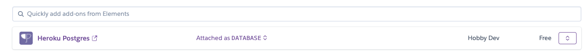


### Set Up a new database. 
1. Returned back to the Resources tab and created a new Postgres URL. 
1. Verified that the new URL had been updated in my Heroku config vars. 
1. Updated settings.py with the new Postgres URL. 
1. Proceeded with the remaining deployment steps and applied all migrations. 
1. Ran python3 manage.py runserver loaddata categories.
1. Ran python3 manage.py runserver loaddata products.
1. Created a new superuser.
1. Removed the new Postgres URL from settings.py when database set up was complete. 
1. Updated variable in GitPod workspace.

This was a very good learning opportunity for me in understanding the importance of keeping information safe when building web apps. Luckily, when creating the new database I didn't encounter any further issues and I was able to move forward quickly.

--- 

## Credits

### Content

- All product and product descriptions were taken from [amazon.com](www.amazon.co.uk). 
- Various pieces of content throughout the site are also taken from the Code Institute Ado Boutique Django Mini Project.  

## Media

- All non product images used for the site were obtained from Canva.com.

## Code

### Ado Boutique
```
Site Structure and Framework: Credit to be given to the Code Institute Mini Course ‘Ado Boutique’. This module helped inspire this project and I used several elements from it to build this site. I found this extremely beneficial as it allowed me to really enhance my learning of Django. Having applied several of the concepts, I now feel much more confident in in my skill level. 
```
 
### Blog:

[Django Central: Building a Blog](https://djangocentral.com/building-a-blog-application-with-django/) - used as additional guidance to build the Blog App.

[Codemy.com](https://www.youtube.com/watch?v=B40bteAMM_M) Django Series for building a Django Blog. 

### Comments Section: 

[Django Central](https://djangocentral.com/creating-comments-system-with-django/): Used to help build out the comments section. 

[Codemy.com](https://www.youtube.com/watch?v=hZrlh4qU4eQ&t=558s) Django Series for buildings blog comments section. 

### Site Components:

[Bootstrap](https://getbootstrap.com/docs/4.0/components/modal/) For building the Modals and Footer.

## Acknowledgements

- I would like to thank and acknowledge my mentor Spencer Barriball for his usual encouragement throughout the project and for the helpful tips and recommendations along the way, thank you for your guidance and support throughout the entire course - you have been great!

- The Code Institute Slack Community which continues to be a fantastic resource when troubleshooting. 

---


