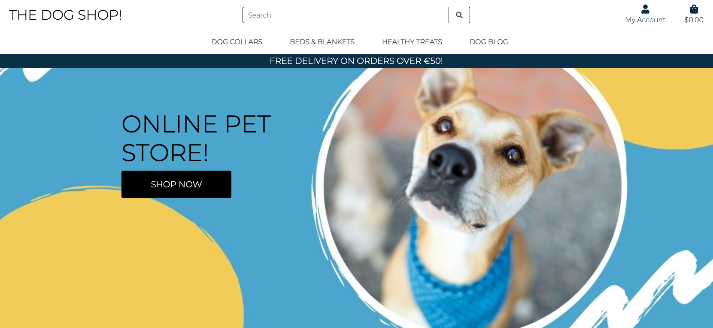

# 
Testing

### W3C Validation

The following pages were passed through the official W3C validation site with no errors returning:

- index.html: No errors or warnings to show.
- products.html: No errors or warnings to show.
- product_detail.html: No errors or warnings to show.
- checkout.html: No errors or warnings to show.
- checkout-success.html: No errors or warnings to show.
- blog.html: No errors or warnings to show.
- blog_detail.html: No errors or warnings to show.

- base.css: Congratulations! No Error Found.

Blog and Product editing pages:
- Edit-post.html
- Edit_product.html

Site validation on both these pages failed due to a Duplicate ID error:  

This is explained more in the Fixed Bugs section.

- Bag.html: 

Site validation failed on this page also due a different Duplicate ID error: 

Resolution details contained in the fixed bugs section.

### JSHint

The following files were passed through JSHint with no warnings detected.

- blog_elements.js
- product_elemets.js
- strip_elements.js

stripe_elements.js threw up some errors which were resolved by adding `/*jshint esversion: 6 */` to the top of the file. One additional error remained which was a missing semi collon. 

### PEP8 Python Validator

PEP8 was used to ensure that all Python code meets PEP8 requirements. All .py files in this project were passed through the PEP8 Python Validator successfully. 

### Browser Validation
- In addition to testing on google chrome, I tested the site fully on the Safari and Firefox browsers.
- Firefox: All tests successful.
- Safari: All tests successful.

### Manual Device Check:

I checked the site manually on the following devices - all pages check checked separately.
- Samsung S10
- Iphone X
- Macbook Pro 
- Dell Laptop
- Ipad Pro
- Samasung Tablet
- Monitor Screen 

#### Link And Hover Validation
I went through each page individually to manually check that all links & hover styling worked as intended. This test was performed on both mobile and desktop devices. 

index.html: 
> - First call to action link on the hero image.
> - Nav Bar: All product links.
> - My account when not logged in state: 
>   - Register, 
>   - Log in. 
> - My Account when logged in state: 
>   - Product Admin, 
>   - Blog Admin, 
>   - My Profile, 
>   - Log Out.

Products.html
> - Product image link 
> - Edit product link
> - Delete product modal

Product_detail.html
>  - Quantity selector
>  - Continue shopping link
>  - Add to bag link
>  - Bag Toast Pop Up
>  - Secure checkout link 

Bag.html
>  - Quantity selector
>  - Continue shopping link
>  - Secure checkout link

Checkout.html
> - Adjust bag link 
> - Complete order link 
> - Checkout_success.html: back to store link

Blog.html
> - Readmore link 

Blog_detail.html
> - Edit blog button
> - Delete blog button
> - Submit comment
> - Delete comment 

Product Admin
> - Add Product and image

Blog Admin
> - Add blog and image
> - Save blog and image

### Form Validation

- Sign in form: 
    - Checked on both mobile, ipad and desktop devices. 
    - Submit form without username added to ensure input field ‘required’ attribute was working correctly and alert displayed prompted customer to add input. 
    - Submit form without password added to ensure input field ‘required’ attribute was working correctly and alert displayed prompted customer to add input.

- Sign up form 
    - Checked on both mobile, ipad and desktop devices. 
    - Submit form without email address added to ensure input field ‘required’ attribute was working correctly and alert displayed prompted customer to input email address. 
    - Submit form without name added to ensure input field ‘required’ attribute was working correctly and alert displayed prompted customer to input email address.

- Add Product Form: 
    - Submitted fully filled in product and reviewed on main products page to ensure review displayed as intended. 
    - Tested adding images.
    - Checked Django Admin to ensure data captured correctly

- Add Blog Form: 
    - Submitted fully filled in blog post and reviewed on blog page to ensure new blog displayed as intended. 
    - Checked Django Admin to ensure data captured correctly
    - Tested adding images.

- Edit Product Form: 
    - Submitted fully filled in product edit and reviewed on product page to ensure new product displayed as intended. 
    - Tested adding new images.
    - Checked Django Admin to ensure data captured correctly

- Edit blog Form: 
    - Submitted fully filled in blog edit and reviewed on blog page to ensure new updated blog displayed as intended. 
    - Tested adding new images.
    - Checked Django Admin to ensure data captured correctly

- Delete Modal: 
  - Fully tested delete model for both product, blog and comments items to ensure modal pop up was presented as intended, and that product/blog/comment was deleted on confirmation. 
  - Checked Django Admin to ensure product/blog removed.

- Password Reset form
  - Checked on both mobile, ipad and desktop devices. 

### Additional Manual Testing:
Super user/admin user has access to the:
- Access to the django admin panel.
- Ability to add and edit products on the main products and individual products pages.
- Product admin page to add products directly to store.
- Superuser only profile page which shows unpublished blogs.
- Blog admin page to add blogs directly to store, or create drafts with ability to save for later. 
- Ability to delete all user comments on blog posts

Toast pop ups display when:
- a site user creates and account, signs in or logs out of their account
- a user adds a product to their bag
- a user updates a product in their bag.
- A user updates information in their profile
- A user makes a purchase
- A user adds or deletes a comment
- An Admin edits or deletes a product 
- An Admin edits or deletes a blog post
- A user attempts to access or use an site owner only page
- An Admin deletes a blog post or comment

### Email Validation

Email verification sent succesfull when account created with link tested:

Email order confirmation sent succesfully after payment succesful with link tested:

### Image Validation

-   I went through each page to ensure all images displayed correctly. 
-   I went through each file to ensure all Alt Text had been applied correctly to each image url to validate accessibility requirements.
- the image rendered on the edit product/blog form was squashed. I will look to improve this in a future release as this is not displayed on the customer facing part of the site, so less of a priority.

### Site Performance Validation

#### First Test

The first report from lighthouse returned poor scores for best practice. Reasons outlined below. 

- Best Practices: Failing elements where:
  - Content Best PracticesFormat your HTML in a way that enables crawlers to better understand your app’s content.
  - Document does not have a meta description

To reseove this I added a meta description tag: `<meta name="description" content="Animal products and services - The Dog Shop"/>`

#### Second Test

With this issues fixed, the site now returns a stronger lighthouse performance score across all key measures:

lighthouse perfromance testing was then carried out on all othersite pages. 

### Stripe Testing

I tested Stripe payments by sending test webhooks: All tests successful.

### Error Handling 

To ensure that any site error is handled gracefully, a 404 and 505 error handler function was added to the page. The site was tested on all pages to generate the 404 message, which displays a simple message to the user, with a redirect to the home page.

### Deployment Version 

All testing was completed in both the development version of the site and the deployed version of the site. 

## User Story Testing

## 
 AS A SITE USER

> I WANT TO BE ABLE TO: Navigate through the site easily 
SO THAT I CAN: Purchase quickly and efficiently 

> I WANT TO BE ABLE TO: View individual products details 
SO THAT I CAN: Decide if the product is what I need 

> I WANT TO BE ABLE TO: Search for products on the site  
SO THAT I CAN: Find what I need quickly  

> I WANT TO BE ABLE TO: Understand why I need to create and account  
SO THAT I CAN: Make a decision on where to share my personal details  

> I WANT TO BE ABLE TO: Make a purchase without having to create an account  
SO THAT I CAN: Do not need to share my personal details  

> I WANT TO BE ABLE TO: Create an account  
SO THAT I CAN: Save my personal information 

> I WANT TO BE ABLE TO: Create an account  
SO THAT I CAN: Comment on and share opinions on recent blog posts 

> I WANT TO BE ABLE TO: Receive email confirmation when creating an account  
SO THAT I CAN: Have confirmation that it was successful 

> I WANT TO BE ABLE TO: Reset my password  
SO THAT I CAN: Access my account if I forget my password 

> I WANT TO BE ABLE TO: Have a personal profile page  
SO THAT I CAN: View my order history  

> I WANT TO BE ABLE TO: Select quantity of individual products  
SO THAT I CAN: Purchase the right quantity I require  

> I WANT TO BE ABLE TO: Be able to delete any personal comments posted  
SO THAT I CAN: Full control over my content  

> I WANT TO BE ABLE TO: Be notified when I add a product to my shopping bag  
SO THAT I CAN: I can easily see what I am buying 

> I WANT TO BE ABLE TO: See the total cost of my purchase before paying  
SO THAT I CAN: Know how my will be charged to be debit/credit card 

> I WANT TO BE ABLE TO: See a payment success or failure message 
SO THAT I CAN: Verify that my purchase has been successful 

> I WANT TO BE ABLE TO: Receive a confirmation email after making a purchase 
SO THAT I CAN: Have a receipt and record of my purchase 

## 
 AS A SITE OWNER

> I WANT TO BE ABLE TO: Add products to the store from the front end  
SO THAT I CAN: Quickly add new products to the site  

> I WANT TO BE ABLE TO: Edit products on the front end  
SO THAT I CAN: Update products details on the site  

> I WANT TO BE ABLE TO: Delete products from the front end  
SO THAT I CAN: Remove products from the site  

> I WANT TO BE ABLE TO: Add blog posts to the site  
SO THAT I CAN: Share relevant information with the site user  

> I WANT TO BE ABLE TO: Edit blog posts on the site  
SO THAT I CAN: Update the content easily  

> I WANT TO BE ABLE TO: Save draft blog posts in my profile  
SO THAT I CAN: Access and finish at a later time before posting to the site  

> I WANT TO BE ABLE TO: View all saved draft blog posts in my admin profile  
SO THAT I CAN: Easily see all unpublished blog posts 

> I WANT TO BE ABLE TO: Delete blog posts from site 
SO THAT I CAN: Remove content from the site  

## Fixed Bugs
 
### Blog and Product editing pages:
- Edit-post.html
- Edit_product.html

Site validation on both these pages failed due to a Duplicate ID error:  

I found this a fairly difficult error to trace back, but after a lot of searching and reading previous comments in the group slack channel, I noticed that the first error was attributed to the fact I had created 2 separate customer_clearable_file_input.html files - one each for the Blog and Product Apps. 

Steps taken to fix:

- Delete the customer widgets template from the blog app - including the customer_clearable_file_input.html file. 
- Delete the widgets.py file from the blog app.
- In the blog app forms.py, import CustomerClearableFileInput from product.widgets.
- This continued to throw the same error. I then changed the file ID name to match the duplicate ID error I was getting to see if this would fix the issue - `new-image` to `id_image`. 
- I changed this in the custom clearable file input file and also the associated JS code. 

This seemed to fix the issue, but another issue was now present where the file input was now displayed as an Input field on the front end. 

To resolve this, I changed the input type from `id_image` to `‘file’` in the customer clearable input file (`Select Image <input type="file"`) and retested. This then finally resolved the issue and all both edit product and edit post files passed through validation successfully.

### Duplicate ID error on the Shopping Bag Page:

- bag.html

This was another error that really took a bit of time to investigate and understand. The error was coming from the quantity form increment/decrement functionality. The original code for this was taken from the course walk through project ‘Ado Boutique’. The code was originally used in the product details page and adapted for the shopping car to enhance the mobile experience. However, this resulted in the same ID’s being used for different functions. 

Steps taken to fix:
- Created a new include file within the Bag App called quantity_input_script.html 
- Added the code from the same named file (quantity_input_script.html) in the Product App. 
- Analysed the files associated with the script to obtain all ID’s causing the issue, in this case they were:
  - `id="decrement-qty_{{ item.item_id }}`
  - `id="increment-qty_{{ item.item_id }}`
  - `id_qty_{{ item.item_id }}`
  - `id="remove_{{ item.item_id }}`
- Changed these ID’s to Classes and removed the ID attribute. 
Updated the bag/includes/quantity_input_script.html file by changing the itemID attribute to ‘Class’. 
- Changed name of includes directory file to point towards the the Bag App file, rather than the Products App file. 
- This resolved the issu. Passing the page through site validation then returned a successful validation.

Additional Bugs fixed:

| Bug | Fix  |
| ---------- | ---- |
| Search Bar returning 505 error page when used on Mobile | Running a search within the search bar on desktop returned the expected results, but when tested on Mobile, the customer 505 error page returned. The issue was related to the incorrect name attribute within the input code line `<input class="border border-black rounded-1" type="text" name="q" placeholder="Search">`, once fixed, the search behaved as expected.|
| Password reset functionality returning 505 error page when email submitted. | Initially, I focused my time reviewing the Allauth templates to try and pin down the error. As all other emails were working, I had assumed it was code related. However, the problem originated from when I set up sending real e-mails from Django and was due to not updating my variables in the GitPod workspace. Once added, I retested and the functionality was fixed.  |
| 505 error handling message when attempting to update user profile information in the Profile App. | This error was returning a 505 at the update information event. Having traced back to views.py, the error was in relation to indentation on the following code   `orders = profile.orders.all()`   `posts = Post.objects.filter(status=0).order_by('-created_on')`. Although this had not been picked up in the terminal when I was building the view, once I fixed it, the error was resolved.|
| Delete Modal was not deleting the correct product, blogpost or comments. Instead, the Modal was deleted from the oldest item added to the site.| I understood what was happening here and that the Modal would be doing a loop and mostly related to the ID’s associated with it. I finally found some good examples of this error from previous students in the slack community which enabled me to pinpoint the issue. To fix this, I updated the Delete Comment Modal Trigger ID to `id="deleteComment_{{ comment.id }}` and matched that to the Main Modal Data Target Attribute. This then resolved the issue and the Modal began deleting the correct item. I applied this anywhere where there were multiple items on one page - Main Products Page, Blog Page and Comments Page. This was of course not required on the individual product page as there is no need to generate unique ID's. |
| HOME navigation links being blocked by form validation requirements on Allauth Forms.| I identified the issue to be related to the `<button>` tag I had added during development. To resolve the issue, I changed the tag back to `<a>` and added in the relevant classes to restyle. Rested and the links navigated as intended. |
|

### Remaining Bugs:

> Allauth form navigation FIXED: 01/09/21 - DETAILS ADDED TO FIXED BUG SECTION 
When testing the Allauth pages, the form validation is working correctly and warning the user that they need to input data in the required fields. However, the validation is also powering up when the link to the home page is clicked. This is not correct behaviour as the home button should allow the user to be redirected to the home page without having to fill in any forms Due to time constraints, this bug will be fixed as part of a future release. Although not a great customer experience, the customer can navigate out using other methods, such as the home link in the navbar, logo link, and any other link in the nav. 

> Toast Popup/Time Delay   
The toast feature is a nice addition to the site. However, there is no time delay and when the event is triggered, the pop up remains on screen until the user clicks on it to remove. This is a poor user experience, especially on mobile. I have decided to keep it as is for now as it is part of the project, however, this will be fixed as part of a future release. 

>Qty Input Selector on bag.html  
The quantity input selector does not disable at the required parameters of 1-99. This works fine on the product details page, but the bug is present on the shopping bag page. 
This issue is only present on desktop. When tested on Mobile, it works as intended. 
I suspect this is due to adapting the quantity selector to fit better on Mobile devices. This requires further investigation and will be fixed as part of a future release. 

---